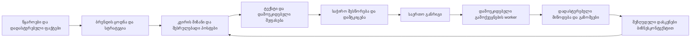

# UNDA Social — არქიტექტურის, ლოგიკისა და მომხმარებლის გამოცდილების აუდიტი

თარიღი: 6 ოქტომბერი, 2026 · დროის სარტყელი: Asia/Tbilisi

## შეფასება

აპლიკაციას აქვს კარგი არქიტექტურული საფუძველი, მაგრამ მიმდინარე შესრულება სრულად ოპტიმალური არ არის. მთავარი გაუმჯობესება საჭიროა ოთხ მიმართულებაში: დავალებების დამოუკიდებელი შესრულება, კონტენტისთვის უფლებამოსილი ფაქტების მიწოდება, რეალური შედეგების გამოყენება მომდევნო გეგმაში და მომხმარებლის განმეორებითი სამუშაოს შემცირება.

| კითხვა | პასუხი |
|---|---|
| ლოგიკა და არქიტექტურა სწორია? | ძირითადი პრინციპები სწორია: მოდელი მსჯელობს, პროგრამა მართავს უფლებებსა და მდგომარეობას. რამდენიმე მნიშვნელოვანი კავშირი ჯერ დასახვეწია. |
| არის ოპტიმალური? | ჯერ არა. საერთო სამუშაო ციკლი ერთმანეთს აყოვნებს დამოუკიდებელ დავალებებს; მონაცემები და შემოწმების კონტრაქტები ზოგ ადგილას მეორდება ან ერთმანეთს სცდება. |
| მომხმარებელს საუკეთესო გამოცდილებას ვაძლევთ? | პროგრესის, ისტორიისა და აღდგენის საფუძველი კარგია. გამოქვეყნების დაგეგმვას, მცირე შესწორებებსა და შენიშვნების გამოყენებას ზედმეტი ძალისხმევა სჭირდება. ლაივ სამუშაო სივრცის შეფასება ამ აუდიტში შეზღუდულია ავტორიზაციით. |
| საუკეთესო შესაძლო შედეგს ვაძლევთ? | ამის მტკიცებულება არ გვაქვს. ფაქტების მიწოდებისა და შედეგებიდან სწავლის მიმდინარე შეზღუდვები უკეთესი შედეგის მიღებას უშუალოდ აფერხებს. |
| დრო შეიძლება შემცირდეს ხარისხის დაკარგვის გარეშე? | დიახ: რიგში ლოდინის, განმეორებითი მოთხოვნების და მომხმარებლის განმეორებითი არჩევანების შემცირებით. ხარისხის შემოწმება უნდა შენარჩუნდეს. ზუსტი პროცენტული დანაზოგი ჯერ გაზომვას საჭიროებს. |

## რა შემოწმდა და რა არ დადასტურებულა

შეფასებულია მიმდინარე ადგილობრივი კოდი, მათ შორის უკვე არსებული დაუკომიტებელი ცვლილებები; აქტიური onboarding, ბრენდის ანალიზი, სტრატეგია, კვირის დაგეგმვა, ტექსტების წერა/შეფასება/შესწორება, ვიზუალები, შენიშვნები, გამოქვეყნება, ანალიტიკა და ავტორიზაცია. წაკითხულია დაყენებული Next.js 16.3.4-ის შესაბამისი ადგილობრივი სახელმძღვანელოები და [Vercel-ის ინტერფეისის წესები](https://raw.githubusercontent.com/vercel-labs/web-interface-guidelines/main/command.md).

გაშვებულია საწარმოო აწყობა, ტიპების შემოწმება, ლინტერი, ძირითადი ტესტები, დამატებითი ფუნქციური ტესტები და ადგილობრივ PostgreSQL-ში იზოლირებული ინტეგრაციის ტესტები. შესრულების დროები წაკითხულია ადგილობრივი ბაზიდან მხოლოდ შეჯამებული სახით. ახალი ფასიანი AI-გენერაცია და სოციალური პოსტის გამოქვეყნება არ შესრულებულა.

ლაივ `app.unda.pro` ავტორიზაციის გვერდი ხელმისაწვდომია. ავტორიზებული სამუშაო სივრცე, რეალური მობილური გამოცდილება, წარმოების დატვირთვა და ლაივ commit-ის შესაბამისობა ამ აუდიტის საწყის შემოწმებაში არ დადასტურებულა. ადგილობრივი სერვერი თავდაპირველად არ მუშაობდა. ამიტომ ქვემოთ მკაფიოდ გამოიყოფა კოდით დადასტურებული პრობლემა და დიზაინის შესამოწმებელი რეკომენდაცია.

აპლიკაციის კოდი არ შეცვლილა. დაემატა მხოლოდ ეს ანგარიში; მომხმარებლის არსებული ცვლილებები შენარჩუნებულია.

## რა მუშაობს კარგად

- `core` დამოუკიდებელია Next.js-ის, PostgreSQL-ისა და მოდელის პროვაიდერისგან. ასეთი მოდულური არქიტექტურა ამ ეტაპზე გამართლებულია.
- წყარო, მტკიცებულება, ცოდნა და მოდელის ინტერპრეტაცია ერთმანეთისგან არის გამოყოფილი. ციტატების შემოწმება ამცირებს გამოგონილი ფაქტების მიღებას.
- აქტიური onboarding იყენებს `DiscoveryClient`-ს: აქვს სერვერზე მონახაზის შენახვა, მოწყობილობაზე აღდგენა და მუდმივი მოთხოვნის ID. ძველი `OnboardingForm` მიმდინარე გვერდის მთავარი გზა აღარ არის.
- ხანგრძლივი სამუშაო ინახება ეტაპებად. შესრულების დროებითი უფლება და მისი უნიკალური გასაღები იცავს მოძველებული შემსრულებლისგან.
- კვირის სტრატეგიის შედგენა უკვე ერთი მოდელის გამოძახებაა. ტექსტები იწერება სამამდე პარალელური დავალებით; ფაქტობრივი და სარედაქციო შეფასებები ერთმანეთისგან დამოუკიდებლად და პარალელურად სრულდება.
- შესწორება ინარჩუნებს საწყის ტექსტს, მიზეზს და გამართულ მეზობელ პოსტებს. მომხმარებლის დამტკიცება კონკრეტულ ვერსიას უკავშირდება.
- ანგარიშის მფლობელის იზოლაცია და გამოქვეყნების გაურკვეველი შედეგის გადამოწმება კარგად არის გააზრებული. გაურკვევლობა ავტომატურად არ ნიშნავს ხელახლა გამოქვეყნებას.
- ინტერფეისი არჩევს „მომზადებულია“, „დამტკიცებულია“ და „გამოქვეყნებულია“ მდგომარეობებს. ანალიტიკაში მიუწვდომელი მონაცემი არ გადაიქცევა გაზომილ ნულად.
- ექსპერიმენტული semantic shadow გამოთვლები ძირითად შეფასებასა და გამოქვეყნების უფლებას არ ცვლის. ეს სწორი საზღვარია; ექსპერიმენტის არსებობა ჯერ ხარისხის გაუმჯობესების მტკიცებულება არ არის.

## მთავარი აღმოჩენები

P1 აღნიშნავს მაღალ პრიორიტეტს — შედეგზე ან საიმედოობაზე პირდაპირ გავლენას. P2 აღნიშნავს მნიშვნელოვან გაუმჯობესებას. ქვემოთ მოცემული რიგი არის რეკომენდებული სამუშაოს პრიორიტეტი და არა დადასტურებული წარმოების ინციდენტების სია.

### 1. P1 — ერთი ხანგრძლივი დავალება აყოვნებს ახალ სამუშაოსა და დაგეგმილ გამოქვეყნებას

მთავარი worker ჯერ კითხულობს ყველა რიგს, შემდეგ ერთ `Promise.allSettled`-ში უშვებს ბრენდის ანალიზს, სტრატეგიას, კვირის გეგმას, ტექსტებს, ვიზუალებს, გამოქვეყნებასა და ანალიტიკას. მომდევნო ციკლი მხოლოდ ყველა მათგანის დასრულების შემდეგ იწყება.

მაგალითად, კვირის გეგმა მზადდება და პოსტების რიგში ახალი დავალება ჩნდება, მაგრამ მიმდინარე ციკლის პოსტების სია უკვე წაკითხულია. ტექსტების დასაწყებად საჭიროა მომდევნო ციკლი; ის შეიძლება სხვა ბრენდის ხანგრძლივ ანალიზს ელოდებოდეს. ანალოგიურად, ციკლის განმავლობაში მოსული გამოქვეყნების დრო შემდეგი გამოქვეყნების შემოწმებამდე იცდის. ერთ worker-ზე ეს არქიტექტურული დაგვიანებაა; დამატებითი რეპლიკები პრობლემას შეიძლება შეამსუბუქებდეს, თუმცა წარმოების კონფიგურაცია არ შემოწმებულა.

AI-worker-ის ბიუჯეტია 540 წამი, ერთი ეტაპისთვის რეზერვი — 480 წამი, ხოლო lease — 600 წამი. ახალი ეტაპის დაწყების პირობა ამიტომ მხოლოდ worker-ის გამოძახების პირველ 60 წამში სრულდება: 540 − 480. უკვე დაწყებულ ეტაპს შეუძლია უფრო დიდხანს გაგრძელდეს, მაგრამ შემდეგი ეტაპისთვის ახალი ციკლი გახდეს საჭირო. შესაბამისად, ციკლის ინტერვალი მხოლოდ ქვედა 3-წამიანი პაუზით არ განისაზღვრება. ანალიტიკის მრავალგვერდიანი კითხვა იმავე საერთო ლოდინშია.

**რეკომენდაცია:** გამოქვეყნებასა და შედეგის გადამოწმებას ჰქონდეს დამოუკიდებელი რეგულარული ციკლი; AI-დავალებებს — მართვადი პარალელურობა თითო სამუშაოს ტიპზე და სამართლიანი განაწილება ბრენდებს შორის. მიმდინარე PostgreSQL რიგები და lease-ები შეიძლება დარჩეს. ახალი message broker ან მიკროსერვისებზე გადასვლა წინაპირობა არ არის.

**შემოწმების კრიტერიუმი:** ხანგრძლივი ბრენდის ანალიზის დროს ახალი პოსტისა და ვადამოსული გამოქვეყნების დაწყება მის დასრულებას არ ელოდება; lease-ისა და დუბლირების დაცვა უცვლელად მუშაობს.

მტკიცებულება: [საერთო ციკლი](<D:/desk/unda project/unda-social-operator/scripts/brand-discovery-worker.mts:27>), [ბიუჯეტი და lease](<D:/desk/unda project/unda-social-operator/src/infrastructure/models/runtime-policy.ts:1>), [ეტაპის დაწყების პირობა](<D:/desk/unda project/unda-social-operator/src/worker/weekly-posts.ts:27>).

### 2. P1 — კონტენტის დამწერი უფლებამოსილ საჯარო ფაქტებსა და მტკიცებულებებს ვერ იღებს

`compilePostGenerationContext` ყოველთვის აბრუნებს `publicFacts: []` და `eligibleProof: []`. დამწერის ინსტრუქცია კი სწორად ამბობს, რომ კონკრეტული საჯარო მტკიცება მხოლოდ ამ მონაცემებით შეიძლება დასაბუთდეს. ბიზნესის აღწერა და პოზიციონირება მისთვის შიდა ორიენტირია.

ეს უსაფრთხოების სასარგებლო საზღვარია, მაგრამ პროდუქტს უზღუდავს შესაძლებლობას, მოამზადოს კონკრეტული შეთავაზების, ფასის, ადგილმდებარეობის, სამუშაო საათების ან დადასტურებული შედეგის შემცველი პოსტი. მხოლოდ კარგი სტილისა და აუდიტორიის გაგება ამ ნაკლს ვერ ავსებს. წყაროს ამონარიდის არსებობა თავისთავად საჯარო მტკიცების უფლებამოსილება არ არის.

**რეკომენდაცია:** ცალკე მართვადი საჯარო ფაქტების ნაკრები — წყაროთი, ზუსტი მნიშვნელობით, ვერსიით, მოქმედების ვადითა და საჭირო დადასტურებით. პოსტს მიეწოდოს მხოლოდ მისი ამოცანის შესაბამისი ფაქტები. შეთავაზების, ფასის და მტკიცებულების გამოყენებას ჰქონდეს მკაფიო ფარგლები; უცნობი მონაცემი დარჩეს უცნობად.

**შემოწმების კრიტერიუმი:** დადასტურებული შეთავაზება შეიძლება ზუსტად გამოიყენოს შესაბამისმა პოსტმა; მოძველებული ფასი, გამოუყენებელი მტკიცებულება და შიდა შენიშვნა საჯარო ტექსტში არ გადადის.

მტკიცებულება: [ცარიელი ავტორიზებული მონაცემები](<D:/desk/unda project/unda-social-operator/src/blueprints/social/weekly-planning/post-context.ts:59>), [დამწერის ფაქტობრივი საზღვარი](<D:/desk/unda project/unda-social-operator/src/blueprints/social/weekly-planning/prompts/posts.ts:22>).

### 3. P1 — ავტომატურად მიღებული ანალიტიკა მომდევნო კვირის დაგეგმვას არ კვებავს

ანალიტიკა ინახება `social_post_analytics`-ში და ჩანს Results გვერდზე. ახალი კვირის დაგეგმვა და სტრატეგია `readWeekEvidence`-ით კითხულობს `social_week_reviews`-ს — ხელით დამატებულ დაკვირვებებს. ამ ორ წყაროს შორის ავტომატური შეჯამების გზა მიმდინარე შესრულებაში არ ჩანს.

შესაძლებელია მაჩვენებლები უკვე გვქონდეს, ხოლო ახალ გეგმას კვლავ გადაეცეს „შედეგები უცნობია“. Results გვერდზეც პირდაპირ წერია, რომ სტრატეგიის შეცვლის დასკვნა ჯერ არ არის ჩამოყალიბებული. მომხმარებელი თავად უნდა აკავშირებდეს რიცხვებს ბიზნესმიზანთან და ხელით ამატებდეს კონტექსტს.

**რეკომენდაცია:** კვირის დაგეგმვის წინ შეიქმნას მოკლე შედეგების ნაკრები: დადასტურებული გამოქვეყნებები, ერთნაირი დაკვირვების პერიოდის მაჩვენებლები, მონაცემების სისრულე, მომხმარებლის ბიზნესკონტექსტი და შეზღუდული დასკვნები. პოსტის იდეა და მიზანი უნდა უკავშირდებოდეს მიღებულ შედეგს. მოწონებები ავტომატურად გაყიდვად ან მიზეზშედეგობრივ მტკიცებულებად არ ჩაითვალოს.

**შემოწმების კრიტერიუმი:** ცნობილი გამოქვეყნება და მისი ცნობილი შედეგი ახალ გეგმაში წყაროთი შედის; განმეორებითი snapshot-ები არ აჯამებს ერთსა და იმავე მაჩვენებელს რამდენჯერმე; მონაცემთა სიმცირე გაურკვევლობას ინარჩუნებს.

მტკიცებულება: [კვირის წყარო](<D:/desk/unda project/unda-social-operator/src/infrastructure/postgres/weekly-planning-store.ts:104>), [ხელით დამატებული დაკვირვებების კითხვა](<D:/desk/unda project/unda-social-operator/src/infrastructure/postgres/social-strategy-store.ts:75>), [ანალიტიკის შენახვა და კითხვა](<D:/desk/unda project/unda-social-operator/src/infrastructure/postgres/social-analytics-store.ts:63>), [Results-ის მიმდინარე დასკვნა](<D:/desk/unda project/unda-social-operator/src/app/workspace/results-client.tsx:17>).

### 4. P1 — English-ის არჩევანი ტექსტის გენერაციის ინსტრუქციებს ეწინააღმდეგება

აქტიურ onboarding-ში მომხმარებელი ირჩევს კონტენტის ენას: ქართული ან English. პოსტის კონტექსტში `contentLanguage` გადადის, მაგრამ საერთო მოდელის ადაპტერი ყველა მოთხოვნას ამატებს ქართულად პასუხის ინსტრუქციას. დამწერის პრომპტიც პირდაპირ ქართულ სოციალურ ტექსტს ითხოვს. გამოქვეყნებისას locale კი არჩეული ენიდან ივსება.

ეს არის კოდით დადასტურებული კონტრაქტების წინააღმდეგობა. ამ აუდიტში ახალი ლაივ ინგლისური გენერაცია არ შესრულებულა, ამიტომ ყველა მოდელის ფაქტობრივი პასუხის ენა არ მტკიცდება.

**რეკომენდაცია:** ინტერფეისის/განმარტებების ენა და გასაქვეყნებელი ტექსტის ენა ცალკე იყოს. დამწერი, შესწორება და ენის შეფასება მიჰყვებოდეს არჩეულ კონტენტის ენას. დაემატოს ინგლისური სრული პროცესის შემთხვევა.

მტკიცებულება: [ენის არჩევანი](<D:/desk/unda project/unda-social-operator/src/app/discovery-client.tsx:117>), [კონტენტის ენა](<D:/desk/unda project/unda-social-operator/src/blueprints/social/weekly-planning/post-context.ts:50>), [ადაპტერის ინსტრუქცია](<D:/desk/unda project/unda-social-operator/src/infrastructure/models/brand-reasoning.ts:30>), [დამწერის ინსტრუქცია](<D:/desk/unda project/unda-social-operator/src/blueprints/social/weekly-planning/prompts/posts.ts:17>).

### 5. P1 — გამოქვეყნების აუდიტი ნამდვილ შეფასებას ზუსტად არ წარმოადგენს

კვირის ტექსტებს რეალური დამოუკიდებელი შემოწმება აქვს, მაგრამ `materializeApprovedPost` გამოქვეყნების კანონიკურ პაკეტს შექმნისას თავიდან აწყობს შეფასებას: ცარიელი `scan`, ცარიელი ხარისხის `dimensions` და ყველა `status: "pass"`. ეს არ არის შენახული ფაქტობრივი შემოწმების პირდაპირი გადატანა.

იმავე ადაპტერში ყველა brief იღებს `evidenceMode: "noProofNeeded"`-ს და ცარიელ მტკიცებულებებს, თუმცა მომხმარებელს შემდეგ შეუძლია `social.proofLed` რეჟიმის არჩევა. სუფთა ლოკალური მაგალითით დადასტურდა, რომ ასეთი შეუსაბამო კომბინაცია materialization-ს გადის. მაგალითს ბაზაში არაფერი შეუნახავს და არაფერი გამოუქვეყნებია.

ამით არ მტკიცდება ადამიანის დამტკიცების გვერდის ავლა: არსებული დამტკიცების წესები მუშაობს. პრობლემა არის აუდიტის სიზუსტე და ორ შეფასების მოდელს შორის წინააღმდეგობა.

**რეკომენდაცია:** გამოიცეს ერთი რეალური შეფასების შედეგი, ტექსტის ვერსიასა და hash-ზე მიბმული; გამოქვეყნების პაკეტმა გადაიტანოს მისი წარმომავლობა. ფაქტის/Proof-ის რეჟიმი განისაზღვროს შეფასებამდე. თუ კვირის შეფასებას სხვა კონტრაქტი აქვს, მას ჰქონდეს აშკარა ტიპი და mapping, ნაცვლად არაშესრულებული სკანერის წარმატების ჩაწერისა.

მტკიცებულება: [brief-ის აგება](<D:/desk/unda project/unda-social-operator/src/application/publishing/materialize-approved-post.ts:35>), [სინთეზური pass](<D:/desk/unda project/unda-social-operator/src/application/publishing/materialize-approved-post.ts:54>), [მომხმარებლის რეჟიმის არჩევანი](<D:/desk/unda project/unda-social-operator/src/app/workspace/social-schedule-controls.tsx:12>).

### 6. P2 — გამოქვეყნების მომზადება მომხმარებლისგან ზედმეტ განმეორებით სამუშაოს ითხოვს

თითო პოსტის თითო არხზე მომხმარებელი თავიდან ირჩევს ანგარიშს, ზუსტ დროს და კონტენტის ტიპს. ანგარიშები ერთიანად უკვე ცნობილია, ხოლო კონტენტის ტიპი ოპერატორის დაგეგმვის გადაწყვეტილება უნდა იყოს, რომელიც საჭიროებისას იცვლება.

იგივე კომპონენტი აქვს თითო პოსტს და თითოეული ცალკე კითხულობს მთელი run-ის ანგარიშებსა და განრიგს. 5 პოსტზე ეს ნიშნავს ერთი და იმავე მონაცემის 5 საწყის მოთხოვნას. API-ს აქვს განრიგის შეცვლისა და გაუქმების გზები, მაგრამ ამ კონტროლებში შესაბამისი ღილაკები არ ჩანს.

`datetime-local`-ის მნიშვნელობა გადაიქცევა `new Date(...)`-ით მომხმარებლის ბრაუზერის დროის სარტყელში. აპლიკაციის დანარჩენი კვირის კონტექსტი თბილისია; ველის გვერდით დროის სარტყელი მკაფიოდ არ ჩანს. სხვა ქვეყანაში გამოყენებისას ეს გაუგებრობას ქმნის.

**რეკომენდაცია:** მთელი კვირის საერთო განრიგის მიმოხილვა; დაკავშირებული ანგარიშების უსაფრთხო საწყისი არჩევანი; ოპერატორის შეთავაზებული დროები მკაფიო დროის სარტყელით; მომხმარებლის ერთი დადასტურება და მარტივი გამონაკლისები. განრიგის შეცვლა/გაუქმება ხელმისაწვდომი იყოს UI-დანაც. მონაცემები ერთხელ ჩაიტვირთოს და პოსტებმა გაიზიარონ.

მტკიცებულება: [განრიგის კონტროლები](<D:/desk/unda project/unda-social-operator/src/app/workspace/social-schedule-controls.tsx:27>), [დროის გარდაქმნა](<D:/desk/unda project/unda-social-operator/src/app/workspace/social-schedule-controls.tsx:37>), [შეცვლისა და გაუქმების API](<D:/desk/unda project/unda-social-operator/src/app/api/social/schedules/route.ts:72>).

### 7. P2 — გეგმა ბოლომდე არ ითვალისწინებს არსებულ გამოქვეყნების შესაძლებლობებს

დამგეგმავი იღებს ცარიელ `confirmedDestinations`-ს, ხოლო პრომპტი ამბობს, რომ არცერთი არხი დაკავშირებული არ არის. მას შეუძლია reel-ის შეთავაზება. კონტენტის შექმნა მისთვის შესაძლებელია, მაგრამ კვირის მიმდინარე პროცესი ვიდეოფაილის ატვირთვას/დაგეგმვას არ ფარავს; scheduling reel-ს უარყოფს.

მომხმარებელი ამზადებს და ამტკიცებს მასალას, რომელიც პროგრამიდან ავტომატურად ვერ გამოქვეყნდება. ვიდეოს რეკომენდაცია შეიძლება ბიზნესისთვის სასარგებლო იყოს, თუმცა მისი შესრულების გზა წინასწარ უნდა ჩანდეს.

**რეკომენდაცია:** დამგეგმავს გადაეცეს რეალური დაკავშირებული არხები, მხარდაჭერილი ფორმატები, არსებული მედია და მომხმარებლის საწარმოო შესაძლებლობები. ავტომატური გამოქვეყნების კონტენტში შეირჩეს შესრულებადი ფორმატები; გადასაღებ ვიდეოს ცალკე მიეთითოს საჭირო სამუშაო და დასრულების გზა.

მტკიცებულება: [არხების ცარიელი კონტექსტი](<D:/desk/unda project/unda-social-operator/src/application/weekly-planning/advance.ts:42>), [დამგეგმავის ინსტრუქცია](<D:/desk/unda project/unda-social-operator/src/blueprints/social/weekly-planning/prompts/posts.ts:7>), [ვიდეოს დაგეგმვის შეზღუდვა](<D:/desk/unda project/unda-social-operator/src/application/publishing/schedule-approved-post.ts:17>).

### 8. P2 — სტატუსის განახლება ზედმეტ მონაცემსა და მოთხოვნებს ატარებს

კვირის გვერდი მთელი `PlanningView`-ით ახლდება მუშაობისას ყოველ 3.5 წამში, დასრულების შემდეგ კი ყოველ 15 წამში; ეს დამალულ ჩანართზეც არ ჩერდება. ერთ გვერდზე მონაცემთა კითხვა მოიცავს მიმდინარე/დამტკიცებულ run-ებს, საფუძველს, ისტორიას, სტრატეგიას, ტექსტებსა და assets-ს. საწყისი გვერდი დამატებით თვითონაც კითხულობს სტრატეგიას.

ერთი გახსნილი გვერდისთვის მხოლოდ ამ polling-ის ინტერვალი დაახლოებით 4 დასრულებულ ან 17 აქტიურ მოთხოვნას იძლევა წუთში, მოთხოვნის შესრულების დროის გაუთვალისწინებლად. ეს არ არის წარმოების დატვირთვის გაზომვა. მომხმარებლების ზრდისას დიდი JSON-პასუხების განმეორებით გადაცემა ზედმეტ ხარჯს ქმნის.

Results გვერდი ყველა ისტორიულ snapshot-ს ერთბაშად კითხულობს და კლიენტს გადასცემს. ინფორმაცია დეტალებში ჩაკეცილია, მაგრამ ჩაკეცვა მის გადაცემას არ აუქმებს.

**რეკომენდაცია:** მსუბუქი სტატუსის პასუხი `updatedAt`/ვერსიით; სრული შედეგის კითხვა მხოლოდ ცვლილებისას; დამალულ ჩანართზე polling-ის შეჩერება; მოთხოვნის გაუქმება გვერდის დატოვებისას; მონაცემების გაყოფა ეკრანის მიხედვით; ანალიტიკის პერიოდით გაფილტვრა და გვერდებად კითხვა. Streaming/SSE დაემატოს მხოლოდ რეალური საჭიროების მიხედვით.

ეს შეესაბამება დაყენებული Next.js-ის რეკომენდაციას კლიენტისთვის მინიმალური მონაცემების მიწოდებაზე და Vercel-ის მოთხოვნების გაზიარების პრაქტიკას.

მტკიცებულება: [მთელი გეგმის polling](<D:/desk/unda project/unda-social-operator/src/app/workspace/weekly-planning-client.tsx:89>), [დიდი პასუხის აგება](<D:/desk/unda project/unda-social-operator/src/infrastructure/postgres/weekly-planning-store.ts:68>), [დამატებითი კითხვები](<D:/desk/unda project/unda-social-operator/src/app/workspace/[[...section]]/page.tsx:54>), [ანალიტიკის სრული ისტორია](<D:/desk/unda project/unda-social-operator/src/infrastructure/postgres/social-analytics-store.ts:72>).

### 9. P2 — მცირე შენიშვნის დამუშავება ხანგრძლივია; დაუგზავნელი ტექსტი არ აღდგება

შენიშვნის ინტერპრეტაცია და პოსტის ახალი ტექსტის შექმნა უშუალოდ HTTP-მოთხოვნის დროს სრულდება. ერთი ლოგიკური გამოძახების მაქსიმუმი 40-წამიანი timeout-ებით და დაშვებული retry-ებით დაახლოებით 121 წამია; ორი თანმიმდევრული გამოძახება დაახლოებით 242 წამამდე შეიძლება მივიდეს. ეს ზედა ზღვარია და არა ჩვეულებრივი ლატენტურობა. კონკრეტული ჰოსტინგის timeout არ შემოწმებულა.

ინტერპრეტაციის შემდეგ პოსტის ხარისხის შეფასება კვლავ სწორად უბრუნდება worker-ს. მაგრამ შენიშვნისთვის აღდგენადი background სამუშაო არ ჩანს. არასრულად გაგზავნილი ტექსტი და უკვე გაშიფრული ხმა მხოლოდ კომპონენტის მეხსიერებაშია. ავტორიზებულ ეკრანთა უმრავლესობაში შენიშვნების დიდი გახსნილი ბლოკი მთავარ შინაარსზე წინ დგას — ეს დიზაინის არჩევანია, რომლის ეფექტი ლაივ მომხმარებლით უნდა შემოწმდეს.

დამტკიცებული პოსტის პირდაპირი ცვლილება სწორად იზღუდება. მომხმარებელს ახალი კვირის ვერსიის შექმნა უწევს; მცირე ცვლილებისთვის მომავალში საჭიროა უფრო ვიწრო ვერსია, რომელიც შესაბამის დამტკიცებასა და განრიგს ხელახლა ამოწმებს.

**რეკომენდაცია:** შენიშვნის მოთხოვნამ სწრაფად შეინახოს დავალება და დააბრუნოს სტატუსი; ხანგრძლივი მსჯელობა იყოს აღდგენადი. დაუგზავნელ ტექსტს ჰქონდეს ბრენდსა და სამიზნეზე მიბმული მონახაზი. მთავარი ქმედება დარჩეს ხილული; შენიშვნა გაიხსნას კონკრეტული კონტექსტიდან ან კომპაქტური მუდმივი კონტროლიდან.

მტკიცებულება: [სინქრონული ინტერპრეტაცია](<D:/desk/unda project/unda-social-operator/src/infrastructure/postgres/contextual-notes-store.ts:185>), [მეორე მოდელის გამოძახება](<D:/desk/unda project/unda-social-operator/src/infrastructure/postgres/contextual-notes-store.ts:215>), [დაუგზავნელი ტექსტის მდგომარეობა](<D:/desk/unda project/unda-social-operator/src/app/workspace/contextual-notes.tsx:36>), [გვერდის აგება](<D:/desk/unda project/unda-social-operator/src/app/workspace/shell.tsx:37>).

### 10. P2 — გამოშვების შემოწმება რეალურ ფუნქციურ რეგრესიას ვერ მოიცავს

`verify` უშვებს lint-ს, ძირითად `test`-ს და build-ს. ცალკე არსებული შენიშვნების/ხმის, პოსტების UX-ის, ვიზუალებისა და ინტეგრაციის კომპლექტები მის შემადგენლობაში არ არის.

დამატებით გაშვებული `voice-silence.test.mts`-ის ერთი ტესტი ჩავარდა: კოდში სიჩუმის ზღვარი 3 წამია, ტესტი კი უფრო ხანგრძლივი პაუზის გაგრძელებას და 6-წამიან წესს ელის. ეს მიმდინარე დაუკომიტებელი ცვლილების ნაწილია. აუდიტი არ ადგენს, რომ აუცილებლად 6 წამი უნდა დაბრუნდეს — დასაზუსტებელია განზრახული UX და მასთან უნდა შეთანხმდეს ტესტი. 3-წამიანი პაუზით ავტომატური გაჩერება რეალური მიმდინარე ქცევაა.

**რეკომენდაცია:** ერთი ძირითადი სწრაფი შემოწმება მოიცავდეს ყველა მიმდინარე ფუნქციურ ტესტს; ცალკე იყოს იზოლირებული ბაზის სრული შემოწმება და ფასიანი AI-ის შეფასებები. სრული სცენარი ამოწმებდეს onboarding → გეგმა → შესწორება → დამტკიცება → განრიგი → გამოქვეყნების შედეგი → შემდეგი კვირა გზას.

მტკიცებულება: [გამოშვების ბრძანება](<D:/desk/unda project/unda-social-operator/package.json:54>), [სიჩუმის მიმდინარე წესი](<D:/desk/unda project/unda-social-operator/src/app/workspace/voice-segmentation.ts:5>), [ჩავარდნილი მოლოდინი](<D:/desk/unda project/unda-social-operator/tests/voice-silence.test.mts:13>).

## არქიტექტურის დახვეწის მიმართულება

ამ ეტაპზე გამართლებულია ერთი აპლიკაცია გამოყოფილი მოდულებით და დამოუკიდებელი worker-ებით. სრული გადაწერა ან მიკროსერვისების დამატება მომხმარებლის მთავარ პრობლემებს თავისთავად არ აგვარებს.

გასაძლიერებელია გამოყენების შემთხვევებისა და ინფრასტრუქტურის საზღვარი: შენიშვნების ინტერპრეტაცია და შეცვლის გადაწყვეტილებები დღეს PostgreSQL store-შია; ზოგი `application` მოდული უშუალოდ ინფრასტრუქტურის ტიპსა თუ ფუნქციაზეა დამოკიდებული. მოდელის, ფაქტების და შენახვის საერთო კონტრაქტები უნდა გადავიდეს გამოყენების შემთხვევების შესაბამის საზღვარზე; store-მა მართოს ტრანზაქცია და მონაცემი. ეს გაამარტივებს ტესტირებას, მოდელის შეცვლასა და დროის გაზომვას.

მთავარი სამიზნე ნაკადი:

შეფასების audit, საჯარო ფაქტი და გამოქვეყნების დამტკიცება ამ ნაკადში უნდა მიუთითებდეს ზუსტად იმ ტექსტისა და წყაროს ვერსიაზე, რომლისთვისაც გამოიცა.

## დროის არსებული მტკიცებულება

ადგილობრივი ბაზის მცირე ნიმუში; მაჩვენებლები არ წარმოადგენს წარმოების p50/p95-ს ან გარანტირებულ მომავალ დროს.

| ეტაპი | ჩანაწერები | დაფიქსირებული დრო |
|---|---:|---:|
| ბიზნესის გაგება | 1 | 64.8 წმ |
| აუდიტორიები | 1 | 44.7 წმ |
| საკომუნიკაციო პროფილები | 1 | 54.1 წმ |
| კომუნიკაციის ჩარჩო | 1 | 54.6 წმ |
| ოთხი AI-ეტაპის ჯამი | 4 | 218.2 წმ — დაახლოებით 3 წთ 38 წმ |
| კვირის სტრატეგია | 1 | 49.4 წმ |
| პოსტების განაწილება | 1 | 56.9 წმ |
| პირველი / მეორე პოსტის წერა | თითო 1 | 19.4 / 20.5 წმ |
| მესამე პოსტის წერა | 4 | საშუალოდ 13.8 წმ თითო მცდელობაზე; 3 ჩანაწერს აქვს შეცდომა |
| ფაქტობრივი შეფასება | 1 | 7.7 წმ |
| სარედაქციო შეფასება | 2 | საშუალოდ 32.5 წმ; ერთ ჩანაწერს აქვს შეცდომა |

ტექსტების წერა და ორი შეფასება პარალელურია, ამიტომ ამ დროების პირდაპირ შეკრება მომხმარებლის მთლიან მოლოდინს არ იძლევა. საპირისპიროდ, ცხრილი არ მოიცავს რიგში ლოდინს, crawl-ს, შენახვას და მომხმარებლის გადაწყვეტილებებს. შეცდომიანი ჩანაწერი არ არის აუცილებლად საბოლოოდ წარუმატებელი დავალება.

პრაქტიკული დასკვნა: ახლა არსებული პარალელურობა უკვე სასარგებლოა. შემდეგი დანაზოგი უნდა ვეძებოთ საერთო რიგის მოლოდინში, განმეორებით კონტრაქტის დარღვევებში, ზედმეტ კონტექსტში და მომხმარებლის ხელით შესრულებულ ნაბიჯებში. სემანტიკური მსჯელობის ეტაპების შერწყმა და უფრო იაფ მოდელზე გადასვლა ცალკე შეფასების გარეშე ხარისხის შენარჩუნებას ვერ ადასტურებს.

## როგორ შევამციროთ დრო ხარისხის დაცვით

| ცვლილება | მოსალოდნელი სარგებელი | ხარისხის დაცვის პირობა |
|---|---|---|
| გამოქვეყნების და AI-ის ციკლების დამოუკიდებლობა | ნაკლები რიგში ლოდინი და დროის გადაცილება | არსებული lease, idempotency და reconciliation შენარჩუნდეს |
| არსებული ფაქტების/სტრატეგიის ვერსიის ხელახლა გამოყენება | უცვლელი ინფორმაციის ხელახლა ანალიზის შემცირება | ცვლილებაზე სწორი invalidation; კერძო მონაცემები არ გაზიარდეს ბრენდებს შორის |
| ფორმატისა და არხის წინასწარი შემოწმება | შეუსრულებელი დავალებისა და ზედმეტი retry-ის შემცირება | ფაქტობრივი მნიშვნელობის შეფასება კვლავ მოდელს დარჩეს |
| მცირე ცვლილების შესაბამისი პოსტის ახალი ვერსია | მთელი კვირის ხელახლა მომზადების შემცირება | შეცვლილ ტექსტს ახალი შემოწმება/დამტკიცება; განრიგთან კავშირი გადამოწმდეს |
| მსუბუქი სტატუსის პასუხი და საერთო მონაცემის ერთი კითხვა | ნაკლები ქსელური/ბაზის დატვირთვა | სისწორე და მფლობელის იზოლაცია დარჩეს თითო მოთხოვნაზე |
| კვირის საერთო განრიგი | ნაკლები განმეორებითი არჩევანი | მომხმარებელი ხედავდეს არხს, დროს, სარტყელსა და გამოსაქვეყნებელ ვერსიას |
| ამოცანაზე მორგებული მოდელი/გამოსვლის ბიუჯეტი | შესაძლებელია პასუხის დროისა და ღირებულების შემცირება | იგივე ბრენდებზე შედარებითი შეფასება; ფაქტის, ხმისა და ენის ხარისხი არ გაუარესდეს |

არ არის რეკომენდებული დამოუკიდებელი ხარისხის შემოწმების მოხსნა, ადამიანური დამტკიცების ჩუმად გაუქმება ან მცირე მონაცემიდან ზედმეტად თავდაჯერებული დასკვნების გამოტანა.

## ხარისხის გაზომვა

„საუკეთესო შედეგი“ უნდა შეფასდეს გამოქვეყნებისთვის მზადყოფნით და მომხმარებლის შრომითაც. არსებულ საცდელ შეფასებებში ჩანს წარმატებული კომპონენტური შემთხვევები Total Charm Dent-ისთვის და კვირების განმეორების მაგალითები. თუმცა ისინი ვერ ამტკიცებს მიმდინარე სრული პროცესის საუკეთესო ხარისხს ყველა ბრენდზე; ზოგ შედეგში გამოყენებული მოდელი განსხვავდება მიმდინარე ნაგულისხმევისგან.

საჭიროა მიმდინარე პრომპტის/მოდელის ვერსიებზე საერთო შეფასებები: ჩვეულებრივი მომსახურების ბიზნესი, მკვეთრი გამორჩეული ხმა, ინგლისური კონტენტი, მცირე წყაროები, ურთიერთსაწინააღმდეგო ფაქტები, ფასიანი შეთავაზება, არასრული მედია და სხვადასხვა კვირის შედეგები. შეუმოწმებელი მტკიცება უნდა დარჩეს დაუშვებელი, ხოლო ხმის სიფრთხილემ ბრენდის სტილი არ გაანეიტრალოს.

საზომები:

- მოთხოვნიდან პირველ სასარგებლო ტექსტამდე და მთლიანად დამტკიცებისთვის მზად კონტენტამდე p50/p95;
- რიგში ლოდინი ცალკე მოდელისა და შენახვის დროისგან;
- მომხმარებლის აქტიური წუთები და ქმედებების რაოდენობა დამტკიცებულ/დაგეგმილ კვირაზე;
- პირველივე შეფასებაზე მიღებული პოსტების წილი, შესწორებების რაოდენობა და ცრუ ბლოკერები;
- სწორ ენაზე, ბრენდის ხმით და სწორი ფაქტებით შექმნილი კონტენტის წილი;
- AI-ხარჯი დამტკიცებულ კვირაზე, შეცდომებისა და ხელახლა ცდის ჩათვლით;
- დაგეგმილიდან დადასტურებულ გამოქვეყნებამდე დაგვიანება და გაურკვეველი შედეგების ასაკი;
- მიზანთან დაკავშირებული მაჩვენებლები, მათი წყარო, პერიოდი და ცნობილი შეზღუდვები.

## შემოწმების შედეგები

| შემოწმება | შედეგი |
|---|---|
| TypeScript და domain build | წარმატებული |
| საწარმოო Next.js build | წარმატებული |
| ძირითადი runtime ტესტები | 311 / 311 წარმატებული |
| დამატებითი ფუნქციური ტესტები, semantic/shadow-ის ჩათვლით | 129 / 130 წარმატებული; ერთი voice-silence შეუსაბამობა |
| ავტორიზაცია, onboarding, dashboard, შენიშვნები, კვირის სამუშაო, scheduling და analytics — იზოლირებული PostgreSQL ინტეგრაციები | 23 / 23 წარმატებული; გამოტოვებული ტესტი არ არის |
| ლინტერი | 0 შეცდომა; 6 გამოუყენებელი ცვლადის/ტიპის გაფრთხილება |
| ახალი ფასიანი ხარისხის შეფასება | არ გაშვებულა |
| ავტორიზებული ლაივ სრული პროცესი | საწყის შემოწმებაში არ დადასტურებულა |

პირველ შეზღუდულ გაშვებაში `tsx`-ის დამტვირთველმა Windows-ის `os.userInfo` ვერ წაიკითხა და semantic ტესტებამდე გაჩერდა. იგივე ტესტები დაშვებულ იზოლირებულ გაშვებაში შესრულდა; ეს გარემოს დაბრკოლება გამოყოფილია ზემოთ აღწერილი რეალური voice-silence ჩავარდნისგან.

ინტეგრაციის ტესტებს აქვს შემთხვევითი სახელის მქონე საკუთარი სქემები და cleanup. ავტორიზაციისას მიღებული უარყოფის ჟურნალები მოსალოდნელი უარყოფითი შემთხვევების ნაწილია. Better Auth-მა დამატებით მიუთითა `auth_rate_limit.lastRequest`-ის int8/number ტიპის განსხვავებაზე; rate-limit ტესტი წარმატებულია, ამიტომ მხოლოდ ამ გაფრთხილებით ავტორიზაციის ხარვეზი არ დასტურდება.

## სამუშაოს რეკომენდებული თანმიმდევრობა

1. **საიმედოობა და შეუსაბამობები:** გამოქვეყნების დამოუკიდებელი ციკლი; ენის არჩევანის შესრულება; არსებული ხმოვანი წესისა და ტესტის შეთანხმება; ძირითადი ფუნქციური ტესტების საერთო შემოწმებაში ჩართვა.
2. **უფრო ძლიერი შედეგი:** საჯარო ფაქტების მართვადი მიწოდება; რეალური შეფასების audit-ის დაკავშირება ტექსტთან; ავტომატური შედეგების მომდევნო კვირაში ჩართვა.
3. **ნაკლები მომხმარებლის შრომა:** შესრულებადი ფორმატების არჩევა; საერთო განრიგი; შეცვლა/გაუქმება; მცირე შესწორების უსაფრთხო ვერსია; შენიშვნის მონახაზისა და ხანგრძლივი სამუშაოს აღდგენა.
4. **გაზომილი ოპტიმიზაცია:** მსუბუქი polling, მოთხოვნების გაზიარება, ეკრანზე მორგებული მონაცემები და პოსტების/შეფასების მოდელების შედარება ერთსა და იმავე ხარისხის მაგალითებზე.

ამ თანმიმდევრობით გაუმჯობესება შესაძლებელია არსებული საფუძვლის შენარჩუნებით. მთავარი მიზანია დადასტურებულ ფაქტებსა და რეალურ შედეგებზე დაფუძნებული კვირის მომზადება, რომლის დამტკიცებასა და გამოქვეყნებას მომხმარებლისგან მინიმალური განმეორებითი შრომა სჭირდება.
